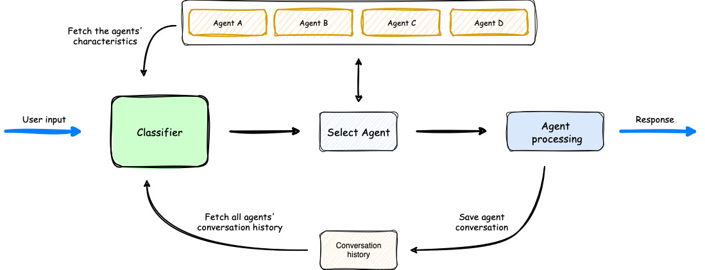

<h2 align="center">Multi-Agent Orchestrator&nbsp;</h2>

<p align="center">Flexible and powerful framework for managing multiple AI agents and handling complex conversations.</p>

<p align="center">
<a href="https://github.com/awslabs/multi-agent-orchestrator"></a>
</p>

## 🔖 Features

- 🧠 **Intelligent Intent Classification** — Dynamically route queries to the most suitable agent based on context and content.
- 🌊 **Flexible Agent Responses** — Support for both streaming and non-streaming responses from different agents.
- 📚 **Context Management** — Maintain and utilize conversation context across multiple agents for coherent interactions.
- 🔧 **Extensible Architecture** — Easily integrate new agents or customize existing ones to fit your specific needs.
- 🌐 **Universal Deployment** — Run anywhere - from AWS Lambda to your local environment or any cloud platform.
- 📦 **Pre-built Agents and Classifiers** — A variety of ready-to-use agents and multiple classifier implementations available.

## What's the Multi-Agent Orchestrator ❓

The Multi-Agent Orchestrator is a flexible framework for managing multiple AI agents and handling complex conversations. It intelligently routes queries and maintains context across interactions. 

The system offers pre-built components for quick deployment, while also allowing easy integration of custom agents and conversation messages storage solutions. 

This adaptability makes it suitable for a wide range of applications, from simple chatbots to sophisticated AI systems, accommodating diverse requirements and scaling efficiently.


## 🏗️ High-level architecture flow diagram

<br /><br />




<br /><br />


1. The process begins with user input, which is analyzed by a Classifier. 
2. The Classifier leverages both Agents' Characteristics and Agents' Conversation history to select the most appropriate agent for the task. 
3. Once an agent is selected, it processes the user input.
4. The orchestrator then saves the conversation, updating the Agents' Conversation history, before delivering the response back to the user. 


## 💬 Demo App

To quickly get a feel for the Multi-Agent Orchestrator, we've provided a Demo App with a few basic agents. This interactive demo showcases the orchestrator's capabilities in a user-friendly interface. To learn more about setting up and running the demo app, please refer to our [Demo App](https://awslabs.github.io/multi-agent-orchestrator/deployment/demo-web-app/) section.

<br>

In the screen recording below, we demonstrate an extended version of the demo app that uses 6 specialized agents:
- **Travel Agent**: Powered by an Amazon Lex Bot
- **Weather Agent**: Utilizes a Bedrock LLM Agent with a tool to query the open-meteo API
- **Restaurant Agent**: Implemented as an Amazon Bedrock Agent
- **Math Agent**: Utilizes a Bedrock LLM Agent with two tools for executing mathematical operations
- **Tech Agent**: A Bedrock LLM Agent designed to answer questions on technical topics
- **Health Agent**: A Bedrock LLM Agent focused on addressing health-related queries

Watch as the system seamlessly switches context between diverse topics, from booking flights to checking weather, solving math problems, and providing health information.
Notice how the appropriate agent is selected for each query, maintaining coherence even with brief follow-up inputs. 

The demo highlights the system's ability to handle complex, multi-turn conversations while preserving context and leveraging specialized agents across various domains.


## 🚀 Getting Started

Check out our [documentation](https://awslabs.github.io/multi-agent-orchestrator/) for comprehensive guides on setting up and using the Multi-Agent Orchestrator!

### Quick Install

```bash
npm install multi-agent-orchestrator
```

### Usage

The following example demonstrates how to use the Multi-Agent Orchestrator with two different types of agents: a Bedrock LLM Agent with Converse API support and a Lex Bot Agent. This showcases the flexibility of the system in integrating various AI services.

```typescript
import { MultiAgentOrchestrator, BedrockLLMAgent, LexBotAgent } from "multi-agent-orchestrator";

const orchestrator = new MultiAgentOrchestrator();

// Add a Bedrock LLM Agent with Converse API support
orchestrator.addAgent(
  new BedrockLLMAgent({
      name: "Tech Agent",
      description:
        "Specializes in technology areas including software development, hardware, AI, cybersecurity, blockchain, cloud computing, emerging tech innovations, and pricing/costs related to technology products and services.",
      streaming: true
  })
);

// Add a Lex Bot Agent for handling travel-related queries
orchestrator.addAgent(
  new LexBotAgent({
    name: "Travel Agent",
    description: "Helps users book and manage their flight reservations",
    botId: process.env.LEX_BOT_ID,
    botAliasId: process.env.LEX_BOT_ALIAS_ID,
    localeId: "en_US",
  })
);

// Example usage
const response = await orchestrator.routeRequest(
  'user123',
  'session456',
  "I want to book a flight"
);

// Handle the response (streaming or non-streaming)
if (response.streaming == true) {
    console.log("\n** RESPONSE STREAMING ** \n");
    // Send metadata immediately
    console.log(`> Agent ID: ${response.metadata.agentId}`);
    console.log(`> Agent Name: ${response.metadata.agentName}`);
    console.log(`> User Input: ${response.metadata.userInput}`);
    console.log(`> User ID: ${response.metadata.userId}`);
    console.log(`> Session ID: ${response.metadata.sessionId}`);
    console.log(
      `> Additional Parameters:`,
      response.metadata.additionalParams
    );
    console.log(`\n> Response: `);

    // Stream the content
    for await (const chunk of response.output) {
      if (typeof chunk === "string") {
        process.stdout.write(chunk);
      } else {
        console.error("Received unexpected chunk type:", typeof chunk);
      }
    }

} else {
    // Handle non-streaming response (AgentProcessingResult)
    console.log("\n** RESPONSE ** \n");
    console.log(`> Agent ID: ${response.metadata.agentId}`);
    console.log(`> Agent Name: ${response.metadata.agentName}`);
    console.log(`> User Input: ${response.metadata.userInput}`);
    console.log(`> User ID: ${response.metadata.userId}`);
    console.log(`> Session ID: ${response.metadata.sessionId}`);
    console.log(
      `> Additional Parameters:`,
      response.metadata.additionalParams
    );
    console.log(`\n> Response: ${response.output}`);
}
```

This example showcases:
1. The use of a Bedrock LLM Agent with Converse API support, allowing for multi-turn conversations.
2. Integration of a Lex Bot Agent for specialized tasks (in this case, travel-related queries).
3. The orchestrator's ability to route requests to the most appropriate agent based on the input.
4. Handling of both streaming and non-streaming responses from different types of agents.


## 🤝 Contributing

We welcome contributions! Please see our [Contributing Guide](CONTRIBUTING.md) for more details.

## 📄 LICENSE

This project is licensed under the MIT License - see the [LICENSE](LICENSE) file for details.

## 📄 Font License
This project uses the JetBrainsMono NF font, licensed under the SIL Open Font License 1.1.
For full license details, see [FONT-LICENSE.md](https://github.com/JetBrains/JetBrainsMono/blob/master/OFL.txt).